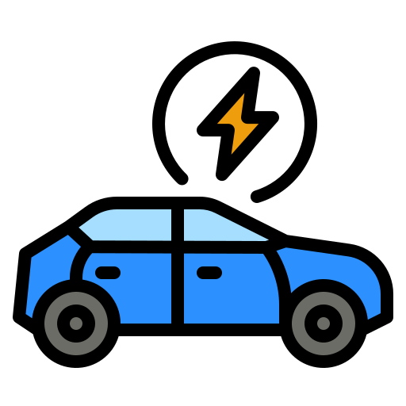
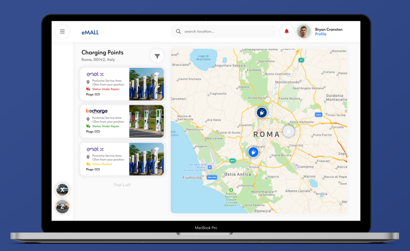
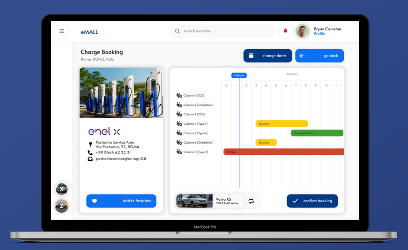
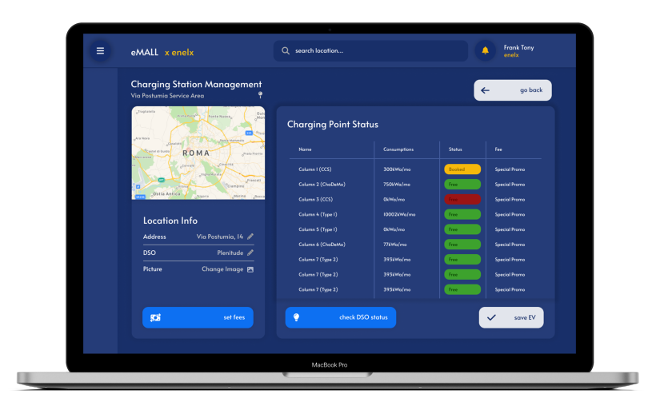

<!-- PROJECT LOGO -->
 

  

<h3 align="center">CelaCelaCogollo</h3>

  

    RASD&amp;DD Project - Software Engineering 2 2023 - Politecnico di Milano
     
     
  

   

<!-- ABOUT THE PROJECT -->
## eMALL

Electric mobility (e-Mobility) is a way to limit the carbon footprint caused by our urban and suburban mobility needs. 
When using an electric vehicle, knowing where to charge the vehicle and carefully planning the charging process in such
a way that it introduces minimal interference and constraints on our daily schedule is of paramount importance. 
e-Mobility Service Providers (eMSPs) offer to end users the possibility to:

1. know about the charging stations nearby, their cost, and any special offers they have;
2. book a charge in a specific charging station for a certain timeframe;
3. start the charging process at a certain station;
4. notify the user when the charging process is finished;
5. pay for the obtained service.

Charging stations are owned and managed by Charging Point Operators (CPOs).

Each CPO has its own IT infrastructure administrated through the so-called Charge Point Management System (CPMS). 
The CPMS handles energy acquisition from external (3rd party) Distribution System Operators (DSOs) and distributes 
it to the connected vehicles, making decisions, such as the amount of energy to be used for each connected vehicle. 
CPOs can dynamically decide from which DSO to acquire energy, for instance, depending on the current price 
and/or on the used mix of energy sources, and, based on these, can dynamically decide the cost of charging 
and set special offers. If batteries are available at the charging station, a CPO can also decide whether 
to store or not energy and whether to use the energy available in the batteries instead of acquiring it from DSOs. 
Human operators can handle these decisions manually or automatically by CPMSs. 
CPO offers the following main functions through their CPMSs:

1. know the location and “external” status of a charging station (number of charging sockets
   available, their type such as slow/fast/rapid, their cost, and, if all sockets of a certain type are
   occupied, the estimated amount of time until the first socket of that type is freed);
2. start charging a vehicle according to the amount of power supplied by the socket, and monitor
   the charging process to infer when the battery is full;
3. know the “internal” status of a charging station (amount of energy available in its batteries, if
   any, number of vehicles being charged and, for each charging vehicle, the amount of power absorbed and time left to the end of the charge);
4. acquire by the DSOs information about the current price of energy;
5. decide from which DSO to acquire energy (if more than one is available);
6. dynamically decide where to get energy for charging (station battery, DSO, or a mix thereof
   according to availability and cost).

The interaction between the various providers (eMSPs, CPOs, and DSOs) occurs through uniform APIs. 
Thanks to this, an eMSP can interact with multiple CPOs and, on the other side, a CPO can interact with various eMSPs. 
Hence, users can exploit a large variety of charging options. Similarly, a CPO can interact with various DSOs and vice versa.

(<a href="#readme-top">back to top</a>)

## Requirements Analysis and Specification Document (RASD)

There are two types of **users** of the system:

* **Electric Vehicle Driver (EVD)**: anybody that owns an electric vehicle and wants to enjoy the functionalities that the eMALL
offers. He is identified with a unique ID, can own more than one vehicle with different specifics. 
He can check prices and positions of charging points, can receive notifications about where he is suggested to charge his
EV, can book a charge and can charge his electric vehicle.
* **Charging Point Operator (CPO)**: company that owns one or more charging stations. It uses the system to manage bookings
done on its charging infrastructure, to create or delete new promotions for its customers, and to provide energy to its infrastructure
communicating with Distribution System Operators (DSOs).

We discuss now some **goals** of the eMALL systems.

To enter in more details, you find the RASD document [here](DeliveryFolder/RASD2.pdf).

(<a href="#readme-top">back to top</a>)

### G1: The EVD can get information about charging stations.

When an EVD wants to search for charging points where to charge his EV, he should define the position of the research:
by default, it is his current position, obtained by the system thanks to a communication with the GPS of the device, 
but the EVD can also define a particular position, i.e., a city, that will be searched exploiting a third-party system
for position and mapping, such as Google Maps.

  

(<a href="#readme-top">back to top</a>)

### G3: The EVD can book a charge for his EV at a charging station for a specified time frame.

When an EVD has selected the charging station in which to book a charging session, he can select the timeframe he prefers
the spot to be reserved for him. He can also get the status of all the charging points of the station and their future
reservations in order to have a complete description of their availability over time.

  

(<a href="#readme-top">back to top</a>)

### G6: The CPO can manage its charging stations and its charging points.

A CPO can manage its Charging Infrastructure. He can create or delete charging stations or points, can modify them,
can get their status, and can set new prices that will be used to elaborate the amount for the payment that will be
done by an EVD after that he terminates a charging session.

  

(<a href="#readme-top">back to top</a>)

## Design Document (DD)

From the Design of the system, we can identify two main concepts:

* **Client-Server Architecture**. We divided Presentation, Business and Data layers in order to have complete independence
between parts. In this way, eventual maintenance sessions or updates are way facilitated. Furthermore, from the
client point of view, we adopted a thin client in order to have it more lightweight and easier to user, since all
data and information are stored on the server side of the system. For the same reason, we increase security and integrity
of data.
* **Microservices Architecture**. Communication between client and server happens through the HTTP protocol. But, thanks to 
the microservices' architecture, we can better forward requests, sending them directly to the microservice
that manages and implements that specific functionality.
This kind of architecture gives several benefits, but we focus on two of them:
  * **Technology Heterogeneity**: since all the nodes are completely independent of each other, developers can use the most
  suitable programming languages and the better tools to develop the functionality for each service.
  * **Availability**: when a service fails, we don't need to halt the whole program to fix it, but we just interrupt the
  execution of the specific microservice that needs an intervention.

To enter in more details, you find the DD document [here](DeliveryFolder/DD1.pdf).

(<a href="#readme-top">back to top</a>)

<!-- LICENSE -->
## License 📄

Distributed under the `MIT` License. See [LICENSE](LICENSE) for more information.

(<a href="#readme-top">back to top</a>)

<!-- CONTACT -->
## Group Members

* Cela Irfan - irfan.cela@mail.polimi.it
* Cela Mario - mario.cela@mail.polimi.it
* Cogollo Alessandro - alessandro.cogollo@mail.polimi.it

(<a href="#readme-top">back to top</a>)

